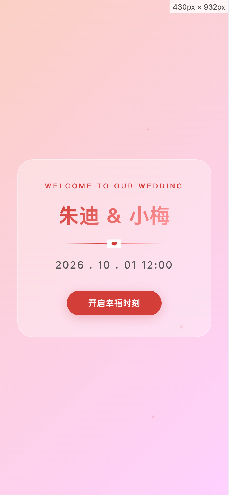
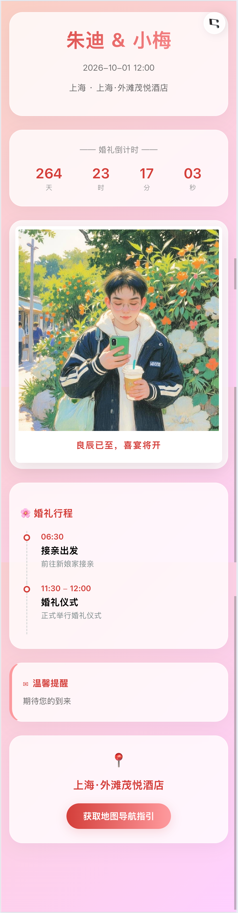
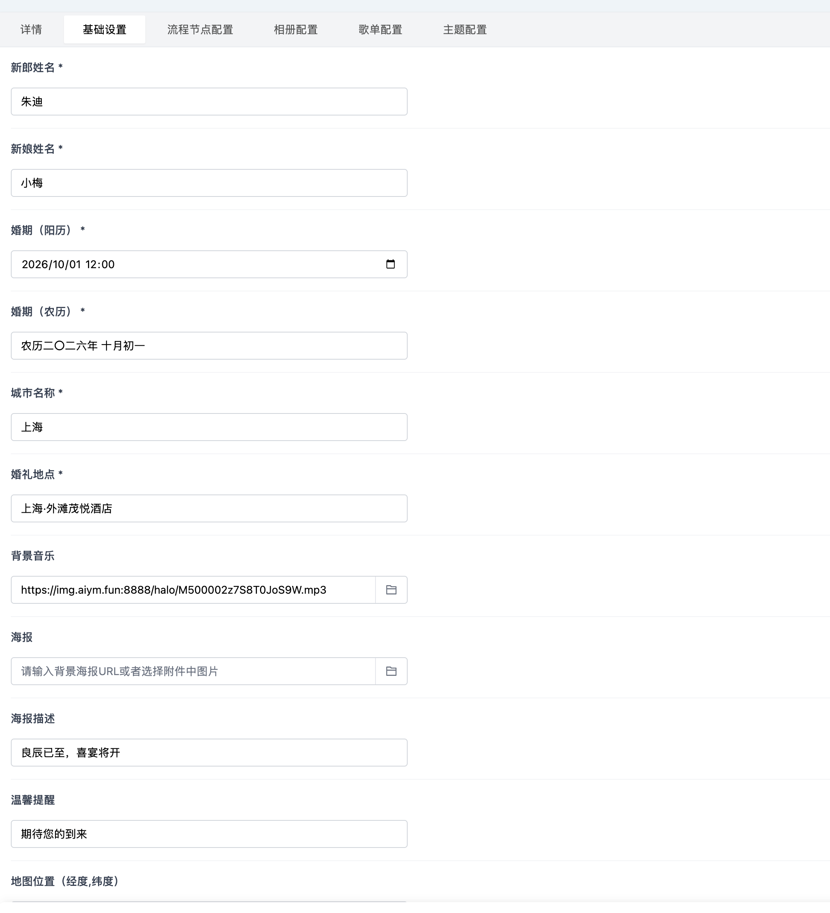
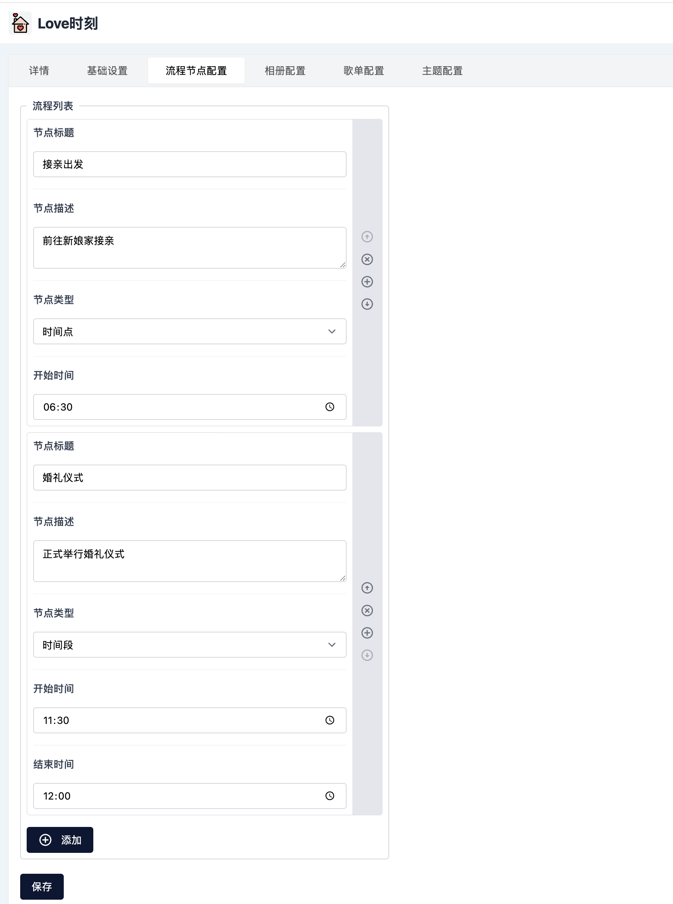

# 婚礼插件 (Wedding Love Plugin)

一个功能完整的 Halo 婚礼插件，为新人打造专属的婚礼展示与互动平台。

## ✨ 目前实现




### 1. 沉浸式开场交互 (Intro Layer)

- **视觉升级**：重构了开场遮罩页，新增 “WELCOME TO OUR WEDDING” 欢迎语及艺术化渐变装饰线。
- **动态对齐**：针对不同型号手机进行了绝对居中优化，确保新人姓名在首屏完美呈现，彻底解决部分机型偏移问题。
- **灵动转场**：集成 GSAP 物理动效，文字入场如呼吸般自然，提升第一眼的“仪式感”。

### 2. 智能行程管家 (Smart Timeline)

- **时段兼容**：行程节点现已全面支持  **“时间点”**  与  **“时间段”** （例如：`10:00 - 11:30`）的灵活配置。
- **实时状态识别**：系统根据当前时间自动切换环节状态：

    - **已完成**：视觉置灰与透明度处理，帮助宾客快速过滤过往信息。
    - **进行中 (LIVE)** ：高亮主题红、伴随呼吸灯动效及闪烁标签，成为页面的视觉焦点。
- **自动定位**：进入页面后，视线将自动平滑滚动至“正在进行”的环节，无需手动翻找。

### 3. 智能环境感知

- **状态切换**：婚礼前显示精准倒计时；婚礼当天自动切换为“今天是我们的婚礼日 🎉”温馨寄语。
- **导航增强**：重写了地图跳转协议，精准适配 **腾讯地图（lat,lng）**  与 **高德地图（lng,lat）**  的坐标顺序，内置和平饭店坐标作为默认降级方案，确保导航 100% 可用。

### 4. 细节体感优化

- **多行提醒**：后台“温馨提醒（remind）”字段现已支持换行配置，方便展示更复杂的交通指引或注意事项。
- **性能起飞**：优化背景固定（Background Fixed）逻辑与 CSS 渲染效率，解决了滑到底部时的颜色断层问题，滑动体验丝滑。

---

## 💡 开发者说

**关于本插件的现状：** 由于个人精力有限，目前 **v1.0.1 版本仅包含这一个核心流程展示页面**。

我希望将所有的精力都倾注在这个最重要的“第一印象”上，力求在有限的篇幅内，把视觉仪式感、音乐氛围、流程指引和地图导航做到极致。目前暂未计划增加其他冗余页面，只为呈现一个最纯粹、精致的婚礼数字请柬。

感谢您的理解与支持，愿这份代码能见证您的幸福。

> 以下是开始构想

## ✨ 功能特性

### 前台功能（H5）

1. **首页（婚礼聚合页）**
   - 新人信息展示、婚期、地点
   - 倒计时 / 幸福进行时 / 幸福已持续天数自动切换
   - 背景轮播图、背景音乐、天气显示
   - 快速跳转菜单

2. **去搂席（邀请函页面）**
   - 婚纱照拼图、视频邀请
   - 地图导航按钮
   - 搂席登记表单（姓名、联系方式、人数、备注等）
   - 提交后弹窗提示
   - 邀请函模板多样式

3. **去观礼（婚礼时间轴）**
   - 后台可配置多个流程节点（时间点或时间段）
   - 状态自动切换：待开始 / 进行中 / 已结束
   - 多段流程（接亲、仪式、宴席）
   - 节点图片、文字、动画展示

4. **幸福相册**
   - 复用 Halo 图库
   - 支持多种展示模式（瀑布流、轮播、旋转木马等）
   - 支持多个图库组合展示

5. **祝福墙**
   - 上方祝福随机滚动、飞字动画
   - 下方表单提交祝福
   - 后台可审核、导出

6. **签到墙**
   - 名字大屏展示
   - 输入姓名签到
   - 生成自定义海报（多模板、可手写签名）
   - 后台查看记录

7. **看歌单**
   - 后台配置歌单、歌曲
   - 支持网易云链接播放
   - 歌单卡片式呈现

### 后台管理

1. **基础设置**：新人姓名、婚期地点、封面图、背景音乐、分享图
2. **主流程配置**：多个流程段、节点管理、图片、文案
3. **幸福相册设置**：选择图库、多选、多样式
4. **歌单设置**：新增歌单、添加歌曲（名称/歌手/链接/上传）
5. **主题配置**：颜色、字体、自定义 CSS（可选）
6. **数据统计**：PV/UV、表单数量
7. **数据管理**：搂席登记、祝福墙、签到墙的审核、导出功能

## 🛠 技术栈

- **后端**: Java 21 + Spring Boot + Halo Plugin API
- **前端模板**: FreeMarker + TailwindCSS
- **管理前端**: Vue 3 + TypeScript
- **构建工具**: Gradle
- **数据存储**: Halo Extension API

## 📋 开发环境要求

- Java 21+
- Node.js 18+
- pnpm
- Halo 2.21+

## 🚀 快速开始

### 安装依赖

```bash
# 安装后端依赖（Gradle 会自动处理）
# 安装前端依赖
cd ui
pnpm install
```

### 开发模式

```bash
# 启动 Halo 开发服务器（会自动编译插件）
./gradlew haloServer

# 在另一个终端启动前端开发服务器
cd ui
pnpm dev
```

### 构建插件

```bash
./gradlew build
```

构建完成后，可以在 `build/libs` 目录找到插件 jar 文件。

## 📁 项目结构

详见 [PROJECT_STRUCTURE.md](./PROJECT_STRUCTURE.md)

## 📚 API 文档

详见 [API_DESIGN.md](./API_DESIGN.md)

## 🔧 配置说明

### 插件配置

插件配置文件位于 `src/main/resources/plugin.yaml`，包含插件的基本信息。

### Extension 定义

Extension 定义文件位于 `src/main/resources/extensions/`，定义了表单数据的结构：
- `attendance.yaml` - 搂席登记表单
- `blessing.yaml` - 祝福墙表单
- `signin.yaml` - 签到墙表单

## 🎨 页面路由

- `/wedding/` - 首页（婚礼聚合页）
- `/wedding/invitation` - 邀请函页面
- `/wedding/timeline` - 婚礼时间轴
- `/wedding/album` - 幸福相册
- `/wedding/blessing` - 祝福墙
- `/wedding/signin` - 签到墙
- `/wedding/playlist` - 歌单页面

## 📝 开发说明

1. **数据存储**: 使用 Halo 的 Extension API 存储表单数据，需要在 Service 实现中完成 ExtensionClient 的调用
2. **配置管理**: 使用 Halo 的 Setting Extension 存储配置信息
3. **前端模板**: 使用 FreeMarker 模板引擎渲染页面
4. **样式设计**: 使用 TailwindCSS CDN，支持响应式设计
5. **动画效果**: 使用 CSS3 和 JavaScript 实现流畅的动画效果

## 🔨 TODO

- [ ] 完善 ExtensionClient 的数据持久化实现
- [ ] 实现海报生成功能（使用 Java 图片处理库）
- [ ] 集成 Halo 图库 API 加载图片
- [ ] 实现统计功能（PV/UV 统计）
- [ ] 完善后台管理前端页面
- [ ] 添加更多邀请函模板
- [ ] 优化移动端体验
- [ ] 添加单元测试

## 📄 许可证

[GPL-3.0](./LICENSE) © Tanzs 

## 🤝 贡献

欢迎提交 Issue 和 Pull Request！

## 📞 联系方式

- GitHub: [@Tanzs](https://github.com/Tanzs)
- Email: 见 GitHub 主页 